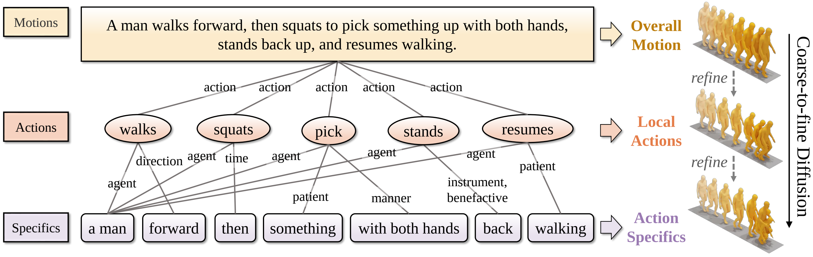
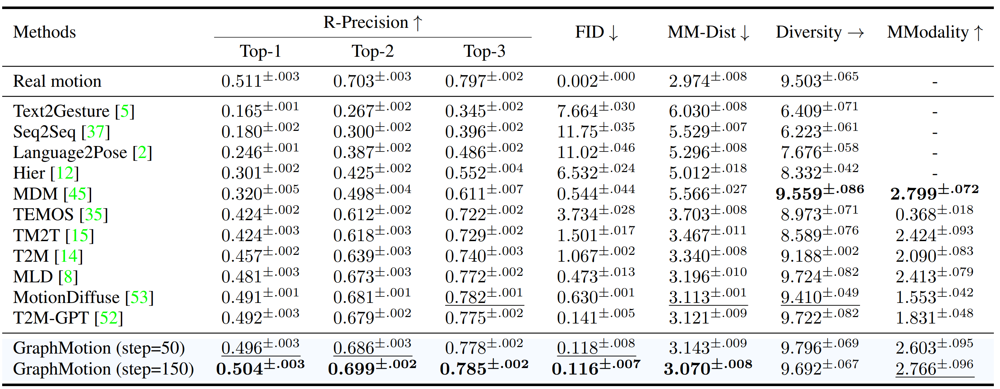
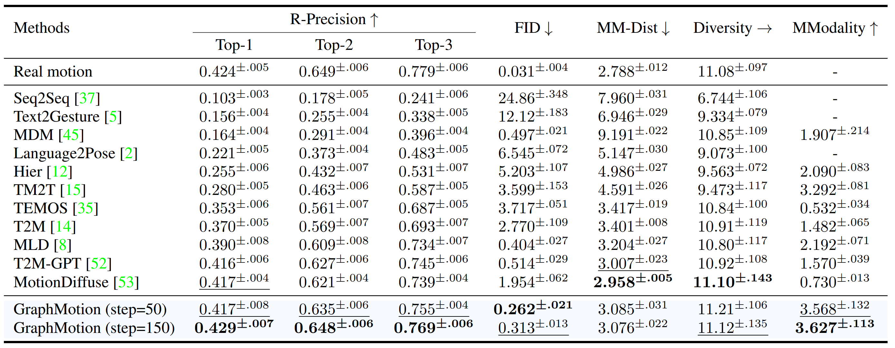

<div align="center">

# 【NeurIPS'2023 🔥】 Act As You Wish: Fine-grained Control of Motion Diffusion Model with Hierarchical Semantic Graphs

[](https://neurips.cc/Conferences/2023)
[]()
</div>

We propose hierarchical semantic graphs for fine-grained control over motion generation.
Specifically, we disentangle motion descriptions into hierarchical semantic graphs including three levels of motions, actions, and specifics.
Such global-to-local structures facilitate a comprehensive understanding of motion description and fine-grained control of motion generation.
Correspondingly, to leverage the coarse-to-fine topology of hierarchical semantic graphs, we decompose the text-to-motion diffusion process into three semantic levels, which correspond to capturing the overall motion, local actions, and action specifics.

<div align="center">


</div>

## 📣 Updates
* Oct 07 2023: We release the code. However, this code may not be the final version. We may still update it later.

## 😍 Visualization

<div align="center">

https://github.com/jpthu17/GraphMotion/assets/53246557/884a3b2f-cf8b-4cc0-8744-fc6cdf0e23aa
</div>


## 🚩 Results
Comparisons to current state-of-the-art methods on the HumanML3D test set.
<div align="center">


</div>

Comparisons to current state-of-the-art methods on the KIT test set.
<div align="center">


</div>

### Datasets

<div align=center>

|Datasets|                                            Google Cloud                                             | Baidu Yun |                             Peking University Yun                             |
|:--------:|:---------------------------------------------------------------------------------------------------:|:---------:|:-----------------------------------------------------------------------------:|
| HumanML3D | [Download](https://drive.google.com/drive/folders/1jjwwtyv6_rZzY7Bz60dEpOKIK9Fwh95S?usp=drive_link) |   TODO    | [Download](https://disk.pku.edu.cn:443/link/A5B4D98E65E9C8CAC42E0F1F9A406F06) |
| KIT | [Download](https://drive.google.com/drive/folders/1dh7zcwDz2M4yaE1Q9LWCHzghG-PWAkO4?usp=drive_link) |   TODO    | [Download](https://disk.pku.edu.cn:443/link/F3ACD26ACB299BA5C7F75A6033E1F686) |
</div>

### Model Zoo
<div align=center>

|Checkpoint|Google Cloud|Baidu Yun|Peking University Yun|
|:--------:|:--------------:|:-----------:|:-----------:|
| HumanML3D | [Download](https://drive.google.com/file/d/1FNT3JpcjMhHDUh0U5LuF3sINk1cynOZ8) | TODO | TODO |
</div>

### 1. Conda environment

```
conda create python=3.9 --name GraphMotion
conda activate GraphMotion
```

Install the packages in `requirements.txt` and install [PyTorch 1.12.1](https://pytorch.org/)

```
pip install -r requirements.txt
```

We test our code on Python 3.9.12 and PyTorch 1.12.1.

### 2. Dependencies

Run the script to download dependencies materials:

```
bash prepare/download_smpl_model.sh
bash prepare/prepare_clip.sh
```

For Text to Motion Evaluation

```
bash prepare/download_t2m_evaluators.sh
```

### 3. Pre-train model

Run the script to download the pre-train model

```
bash prepare/download_pretrained_models.sh
```
### 4. Evaluate the model

Please first put the tained model checkpoint path to `TEST.CHECKPOINT` in `configs/config_humanml3d.yaml`.

Then, run the following command:

```
python -m test --cfg configs/config_humanml3d.yaml --cfg_assets configs/assets.yaml
```

## 💻 Train your own models

### 1.1 Prepare the datasets

For convenience, you can download the datasets we processed directly. For more details, please refer to [HumanML3D](https://github.com/EricGuo5513/HumanML3D) for text-to-motion dataset setup.

<div align=center>

|Datasets|                                            Google Cloud                                             | Baidu Yun |                             Peking University Yun                             |
|:--------:|:---------------------------------------------------------------------------------------------------:|:---------:|:-----------------------------------------------------------------------------:|
| HumanML3D | [Download](https://drive.google.com/drive/folders/1jjwwtyv6_rZzY7Bz60dEpOKIK9Fwh95S?usp=drive_link) |   TODO    | [Download](https://disk.pku.edu.cn:443/link/A5B4D98E65E9C8CAC42E0F1F9A406F06) |
| KIT | [Download](https://drive.google.com/drive/folders/1dh7zcwDz2M4yaE1Q9LWCHzghG-PWAkO4?usp=drive_link) |   TODO    | [Download](https://disk.pku.edu.cn:443/link/F3ACD26ACB299BA5C7F75A6033E1F686) |
</div>

### 1.2 Prepare the Semantic Role Parsing (Optional)

Please refer to "prepare/role_graph.py". 

We have provided semantic role-parsing results (See "datasets/humanml3d/new_test_data.json").
<details>
<summary><b>Semantic Role Parsing Example</b></summary>

```
        {
            "caption": "a person slowly walked forward",
            "tokens": [
                "a/DET",
                "person/NOUN",
                "slowly/ADV",
                "walk/VERB",
                "forward/ADV"
            ],
            "V": {
                "0": {
                    "role": "V",
                    "spans": [
                        3
                    ],
                    "words": [
                        "walked"
                    ]
                }
            },
            "entities": {
                "0": {
                    "role": "ARG0",
                    "spans": [
                        0,
                        1
                    ],
                    "words": [
                        "a",
                        "person"
                    ]
                },
                "1": {
                    "role": "ARGM-MNR",
                    "spans": [
                        2
                    ],
                    "words": [
                        "slowly"
                    ]
                },
                "2": {
                    "role": "ARGM-DIR",
                    "spans": [
                        4
                    ],
                    "words": [
                        "forward"
                    ]
                }
            },
            "relations": [
                [
                    0,
                    0,
                    "ARG0"
                ],
                [
                    0,
                    1,
                    "ARGM-MNR"
                ],
                [
                    0,
                    2,
                    "ARGM-DIR"
                ]
            ]
        }
   ```

</details>

### 2.1. Ready to train VAE model

Please first check the parameters in `configs/config_vae_humanml3d_motion.yaml`, e.g. `NAME`,`DEBUG`.

Then, run the following command:

```
python -m train --cfg configs/config_vae_humanml3d_motion.yaml --cfg_assets configs/assets.yaml --batch_size 64 --nodebug
python -m train --cfg configs/config_vae_humanml3d_action.yaml --cfg_assets configs/assets.yaml --batch_size 64 --nodebug
python -m train --cfg configs/config_vae_humanml3d_specific.yaml --cfg_assets configs/assets.yaml --batch_size 64 --nodebug
```

### 2.2. Ready to train GraphMotion model

Please update the parameters in `configs/config_humanml3d.yaml`, e.g. `NAME`,`DEBUG`,`PRETRAINED_VAE` (change to your `latest ckpt model path` in previous step)

Then, run the following command:

```
python -m train --cfg configs/config_humanml3d.yaml --cfg_assets configs/assets.yaml --batch_size 128 --nodebug
```

### 3. Evaluate the model

Please first put the tained model checkpoint path to `TEST.CHECKPOINT` in `configs/config_humanml3d.yaml`.

Then, run the following command:

```
python -m test --cfg configs/config_humanml3d.yaml --cfg_assets configs/assets.yaml
```

## ▶️ Demo
TODO

## 📌 Citation
If you find this paper useful, please consider staring 🌟 this repo and citing 📑 our paper:
```
TODO
```

## 🎗️ Acknowledgments
Our code is based on [MLD](https://github.com/ChenFengYe/motion-latent-diffusion), [TEMOS](https://github.com/Mathux/TEMOS), [ACTOR](https://github.com/Mathux/ACTOR), [HumanML3D](https://github.com/EricGuo5513/HumanML3D) and [joints2smpl](https://github.com/wangsen1312/joints2smpl). We sincerely appreciate for their contributions.
